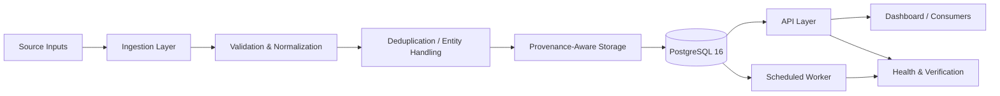
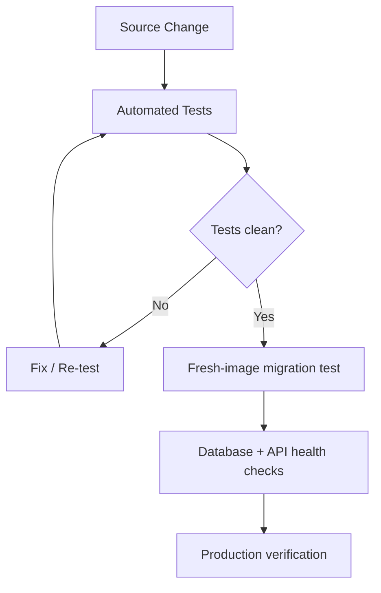

# Canada B2B Platform — Public Architecture

This diagram intentionally shows system boundaries and engineering controls without exposing source endpoints, raw records, credentials, or proprietary entity-matching logic.

## Release controls

### Verified checkpoint

At the documented 3 October 2026 checkpoint:

- 2,743,454 live establishments
- 815,427 organizations
- coverage across 10 provinces and 3 territories
- PostgreSQL 16
- schema 0005
- API 0.2.0
- 435 tests collected / 423 passed / 0 failed / 12 skipped
- fresh-image migration 0001 → 0005 verified in a disposable database

These are engineering-scale and verification metrics, not claims of customer revenue or business outcomes.
