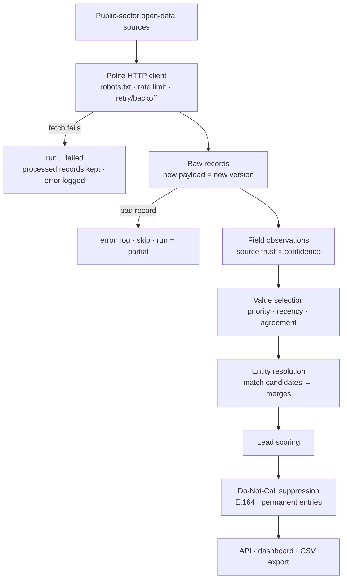
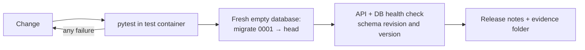

# Canadian B2B data platform — architecture (anonymized)

> Client project. This page shows the logical design only. It contains no client code, endpoints, credentials, source configuration, infrastructure details or data.

## Data flow and failure handling

## Release gate

