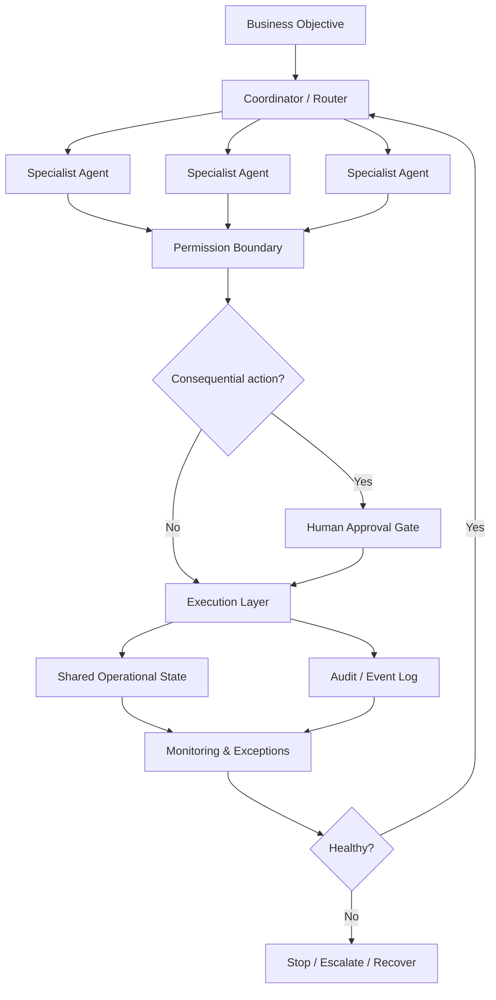

# Multi-Agent Operations — Control Plane

The public architecture focuses on how delegated automation is constrained and observed.

## Control principles

**Least authority.** An agent should receive only the capability needed for its responsibility.

**Human gates.** Consequential external actions should not become autonomous merely because an LLM can propose them.

**Observable state.** Work should be traceable through state and event records rather than relying on conversational memory.

**Failure containment.** Exceptions need a stop, retry, recovery, or escalation path.

**Commercial integrity.** Revenue, payment, prospect, and outcome states must come from verified system evidence rather than model-generated claims.

## Public boundary

No production prompts, credentials, prospect/customer records, private databases, or proprietary operating rules are included here.
