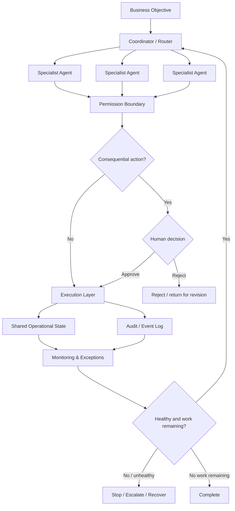

# Multi-Agent Operations — Design Note

> **Status:** architecture/design note. This page does not, by itself, claim that a deployed multi-agent system is proven by this public repository. Runtime claims belong here only when public evidence is available.

The purpose of this design is to show how delegated automation can be constrained, approved and stopped.

## Design principles

- Give each specialist only the capability required for its role.
- Require an explicit approve/reject decision for consequential actions.
- Keep operational state and event history outside conversational memory.
- Give failures a stop, recovery or escalation route.
- End execution when the objective is complete or a budget/operational boundary is reached.

## Evidence boundary

This page is intentionally a design note until sanitized runtime evidence can be published. It contains no production prompts, credentials, prospect/customer records, private databases, or proprietary operating rules.
