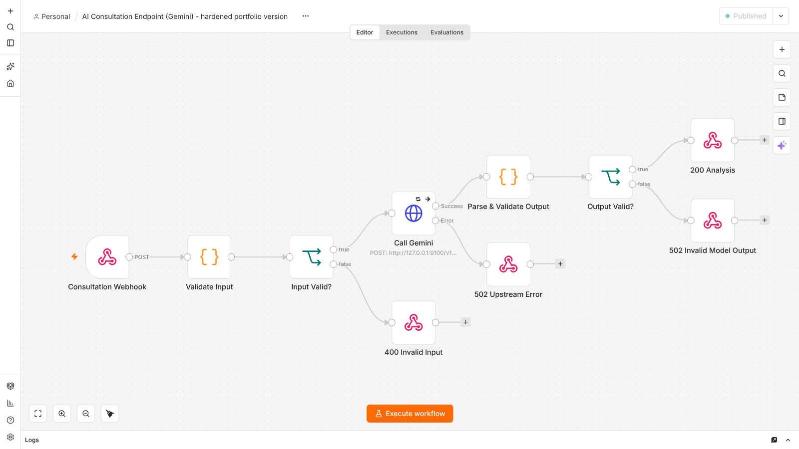

# AI consultation endpoint (n8n + Gemini)

**Status:** tested on a clean n8n **2.41.6** instance on 4 Oct 2026. **10/10 test cases pass.** The model endpoint was a local test double during testing; a live Gemini call was **not** part of this test run.

## Problem

The LukeZigger website backend needs a short, structured analysis of a visitor's described business problem. The backend must not hold the model API key, and it must never get an empty or malformed answer reported as success.

## Flow



```text
POST /webhook/lz-consultation  (n8n Header Auth: x-webhook-secret)
  → Validate Input ── invalid ──────────────────────────→ 400 {error: invalid_input, details}
  → Call Gemini (header API key, 3 attempts, 2 s apart)
        └─ fails after 3 attempts ──────────────────────→ 502 {error: upstream_model_error}
  → Parse & Validate Output
        └─ no candidates / blocked / non-JSON / wrong shape → 502 {error: <reason>}
  → 200 {requestId, model, result}
Every response carries X-Request-Id (taken from the caller's x-request-id, or the n8n execution id).
Wrong or missing secret → 403, from n8n's own webhook authentication, before the workflow runs.
```

**Input contract:** `{"problem": string, 20–4000 chars, "industry"?: string ≤ 80 chars}`
**Output:** `summary`, `automation_opportunities[] {process, suggested_automation, tools[], complexity: low|medium|high}`, `risks[]`, `next_step`. The output is enforced twice: by Gemini's `responseSchema` and again by the n8n code node.

## What changed from the original (July 2026)

The original 6-node workflow was written for the LukeZigger website backend; the backend side adds its own timeout and one transport retry. Running it unchanged on n8n 2.41.6 ([log](original-workflow-behaviour.txt)) showed:

| Original behaviour | Fix |
|---|---|
| The secret check read `$env.…` in an expression. n8n 2.x blocks env access by default, so **every request returned HTTP 500** (`access to env vars denied`) and the model was never called | n8n's built-in webhook Header Auth with a stored credential |
| The caller's raw `prompt` was passed straight to the model | A fixed system instruction plus a validated `problem`/`industry` input; the user text is treated as data |
| An empty or blocked model reply became **HTTP 200 with an empty body** | Explicit 502 responses for: no candidates, `finishReason` other than STOP, missing text, invalid JSON, schema mismatch |
| No retry; an upstream error crashed the run | 3 attempts, 2 s apart, then a controlled 502 |
| JSON was requested but returned as `text/plain` | JSON responses with explicit status codes |
| API key sent as a `?key=` query parameter | `x-goog-api-key` header credential (the [mock log](mock-model-request-log.txt) shows header present, no key in the URL) |
| No correlation id | `X-Request-Id` on every response |

## Test results (4 Oct 2026, n8n 2.41.6)

Full output: [test-run.txt](test-run.txt)

| # | Case | Expected | Result |
|---|---|---|---|
| 1 | Valid authenticated request | 200 + validated JSON | pass |
| 2 | Missing secret | 403 | pass |
| 3 | Wrong secret | 403 | pass |
| 4 | Empty body | 400 | pass |
| 5 | Problem too short | 400 | pass |
| 6 | Wrong field types | 400 | pass |
| 7 | Model returns HTTP 500 | 3 attempts, then 502 | pass ([execution](exec-07-upstream-500-retried-502.png), 4.2 s) |
| 8 | Model returns no candidates (safety block) | 502 `empty_model_response` | pass |
| 9 | Model returns non-JSON text | 502 `invalid_model_json` | pass |
| 10 | Model returns JSON in the wrong shape | 502 `model_output_schema_mismatch` | pass |

**How it was tested:** for the test, a copy of `workflow.json` was imported with two changes only: the credential IDs, and the model URL pointed at [`mock-gemini.js`](mock-gemini.js), a local server that returns Gemini-format responses and simulates failures. The published `workflow.json` itself was then imported through the n8n editor API as a separate check, which also succeeded.

## Setup

1. Import `workflow.json`.
2. Create a **Header Auth** credential named `x-webhook-secret` with a long random value, and select it on the webhook node.
3. Create a **Header Auth** credential named `x-goog-api-key` with your Gemini API key, and select it on *Call Gemini*.
4. Publish the workflow, then run `WEBHOOK_SECRET=… N8N_BASE=https://your-n8n run_tests.sh`. Cases 7–10 need the mock model URL; against live Gemini, expect them to return 200.

## Limitations

- Not yet run against live Gemini with this exact version. The mock reproduces Gemini's documented response format, not its content quality.
- n8n retries every error, including 4xx (for example, an invalid key). A production version should retry only 429 and 5xx responses.
- No rate limiting per caller. Put the webhook behind a reverse proxy or API gateway for that.
- Execution data, including the user's text, is saved in n8n (`saveDataSuccessExecution: all`) for audit purposes. Set a retention period that fits your privacy obligations.
