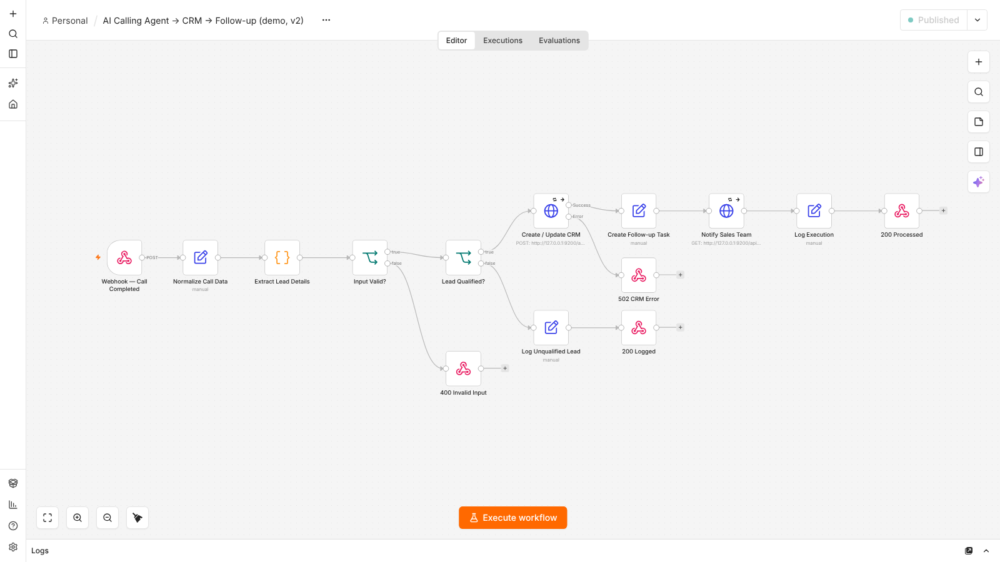

# AI call outcome → CRM → sales follow-up (n8n, demo)

**Status:** demo workflow, tested on n8n **2.41.6** on 4 Oct 2026 against a local mock CRM: **6/6 cases as expected**. It has not been connected to a real voice agent or a real CRM.

## Problem

An AI voice agent finishes a call and posts a summary. Qualified callers must reach the CRM and the sales team quickly. Unqualified calls should be logged and not create CRM noise. If the CRM is down, the caller system must be told, not left with a silent loss.

## Flow



```text
POST /webhook/lz-call-completed-demo (Header Auth)
  → Normalize → Extract & qualify (keywords / outcome) → Input Valid? ── no → 400
  → Lead Qualified?
      ├─ yes → CRM upsert (3 attempts) ── fails → 502 crm_unavailable
      │         → follow-up task → notify sales (2 attempts, non-blocking) → 200 processed
      └─ no  → log → 200 logged
```

## What changed from the original (exported 3 Sep 2026)

The original was tested unchanged, with its two `example.com` endpoints pointed at the mock CRM ([log](original-workflow-test-run.txt)):

| Original behaviour | Fix |
|---|---|
| CRM body built by string templating, so a `"` in the call summary produced **invalid JSON**, which the CRM received as a string | Body built with `JSON.stringify` on an object |
| The follow-up node dropped the lead fields, so **the sales alert read "Qualified call:  —  —"** with no name | Fields carried through; the alert names the caller |
| Webhook replied "Workflow was started" at once, so the caller never learned the outcome | Responds at the end with 200 / 400 / 502 |
| Missing fields were replaced with a fake sample lead | Required `name`, `phone`, `call_summary`; 400 if missing |
| No retry or error path on the CRM call | 3 attempts, then 502 |
| No webhook authentication | Header Auth credential |

## Test results (4 Oct 2026)

[test-run.txt](test-run.txt) · script: [run_demo_tests.sh](run_demo_tests.sh) · mock CRM: [mock-crm.js](mock-crm.js)

| Case | Result |
|---|---|
| Qualified call | 200; CRM received valid JSON; sales alert names the caller ([execution](exec-qualified-200.png)) |
| Summary containing quotes | 200; CRM body still valid JSON |
| Unqualified call | 200 `logged`, no CRM call |
| Missing phone/summary | 400 |
| CRM returns 500 | 3 attempts, then 502 `crm_unavailable` ([execution](exec-crm-down-retried-502.png)) |
| No secret | 403 |

## Limitations

- Qualification is keyword-based.
- The CRM and notification endpoints are placeholders (`*.example.invalid`). Replace them with your CRM's node or API and its credential.
- The "log" steps keep data only in n8n's execution history. Use a sheet or database for a durable log.
- CRM upsert idempotency (de-duplicating by phone) depends on the CRM API and is not handled here.
