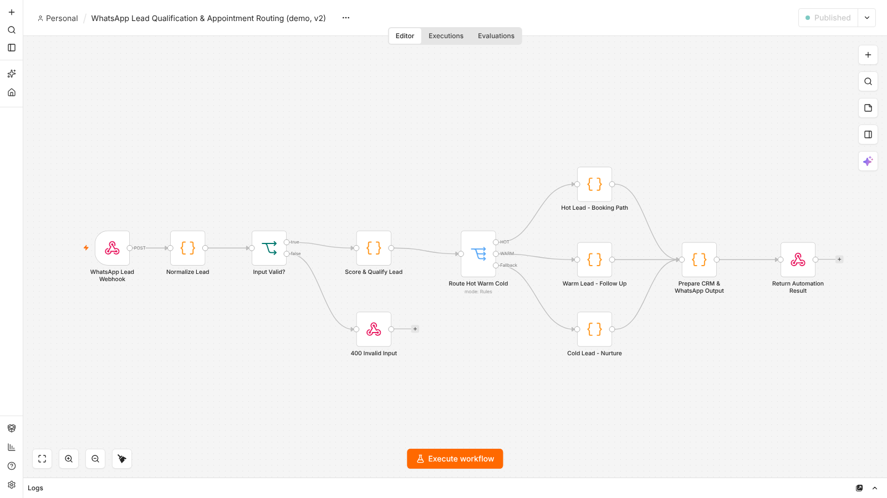

# WhatsApp lead qualification & appointment routing (n8n, demo)

**Status:** demo workflow, tested on n8n **2.41.6** on 4 Oct 2026, **5/5 cases as expected**. It does not connect to WhatsApp, a calendar or a CRM. It returns the decision and the suggested reply as JSON, for the caller to act on.

## Problem

A clinic gets appointment requests as free-text WhatsApp messages. Staff read each one, decide how urgent it is, and type a reply. This workflow does the first pass: it extracts the service, date and time, scores the lead, routes it Hot / Warm / Cold, and prepares the reply text and the CRM stage.

## Flow



```text
POST /webhook/lz-whatsapp-lead-demo (Header Auth)
  → Normalize Lead: service, date, time, intent from the message text
  → Input Valid? ── no ──→ 400 {error: invalid_input, details}
  → Score & Qualify (rules) → Switch: Hot ≥ 80 / Warm ≥ 60 / Cold
  → path-specific reply text, CRM stage and calendar action → 200 JSON
```

## What changed from the original (exported 4 Sep 2026)

Running the original unchanged ([log](original-workflow-test-run.txt)) showed three defects:

| Original behaviour | Fix |
|---|---|
| An **empty request produced a "Hot" lead** for a made-up sample person, because missing fields fell back to demo defaults | Required `message` and `phone`; returns 400 with the missing fields |
| Intent was hard-coded as "Appointment Booking", so every lead scored at least 65 and **Cold was unreachable** | Intent detected from booking words; the base score was lowered from 40 to 20 |
| A dentist enquiry with no date or time scored **Hot** | Now scores Warm (60) and the reply asks for a date and time |
| No webhook authentication | n8n Header Auth credential |

## Test results (4 Oct 2026)

[test-run.txt](test-run.txt). The test script is shared with the calling-agent workflow: [`../calling-agent-crm-followup/run_demo_tests.sh`](../calling-agent-crm-followup/run_demo_tests.sh).

| Case | Result |
|---|---|
| Dermatology, "tomorrow at 6 PM" | 200, Hot (80), booking path ([execution](exec-hot-lead-200.png)) |
| Dentist visit, no date/time | 200, Warm (60), asks for details |
| "What are your opening hours" | 200, Cold (25), nurture ([execution](exec-cold-lead-200.png)) |
| Empty body | 400, missing `message` and `phone` ([execution](exec-empty-input-400.png)) |
| No secret | 403 |

## Limitations

- Keyword rules only, English only. There is no language model in this workflow.
- "Tomorrow" and "today" are returned as words, not dates, and no time zone is applied.
- It produces actions but does not perform them. Sending through the WhatsApp Business API, checking a real calendar, and writing to a CRM are not implemented.
- Health-related messages are personal data. A real deployment needs consent handling and a retention policy for n8n execution data.
